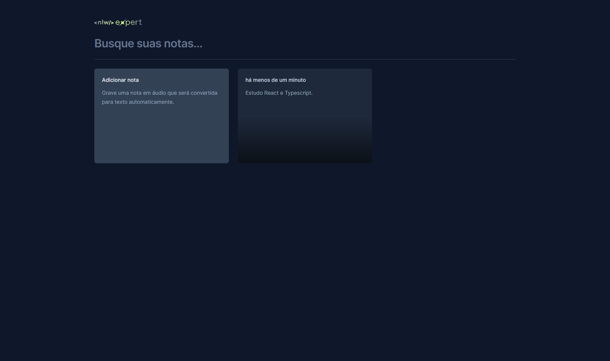
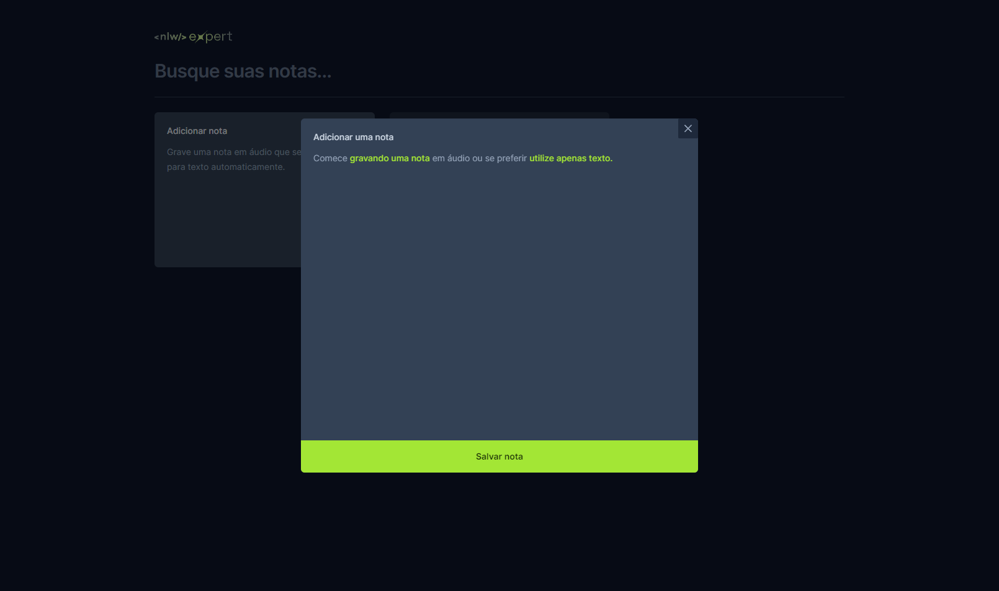
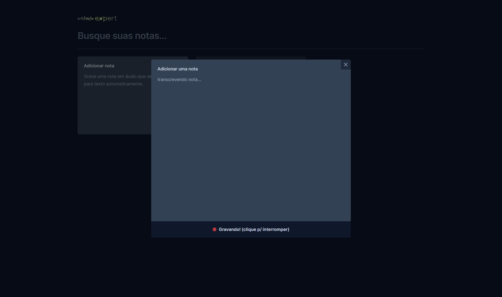

# EXPERT NOTES 

> NLW EXPERT trilha React - Rockeseat

Projeto desenvolvido na semana da NLW, onde consiste em criar notas/lembretes seja digitando ou gravando em áudio, que automaticamente é transcrito por meio da API Speech Recognition do browser.  
Funcionalidade de adicionar e apagar uma nota, armazenando a informação no local storage.

## 👨‍💻🛠 Tecnologias e APIs

- React.js
- TypeScript
- Vite
- Tailwind CSS
- API Speech Recognition
- Web Storage
- Git e Github

## 📩 Contato

wedley.pereira2011@hotmail.com